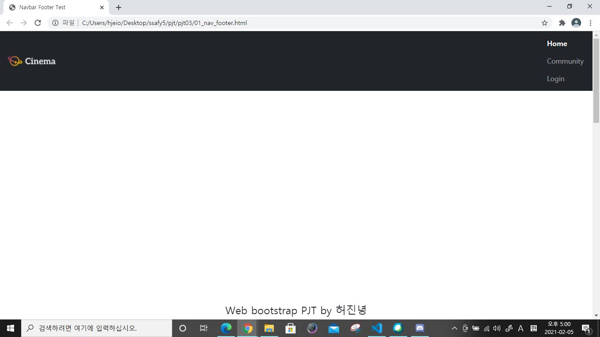
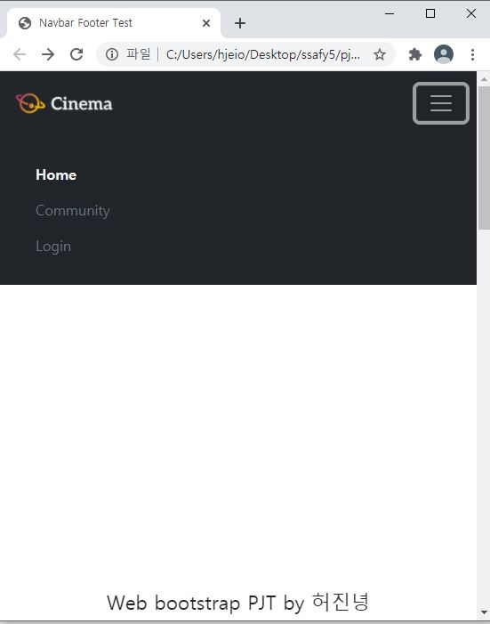
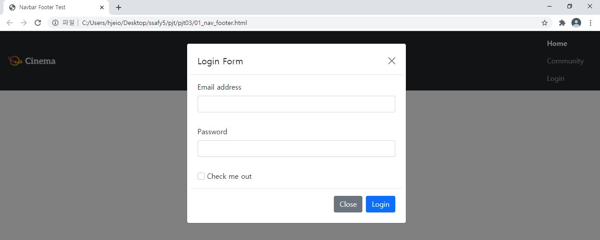
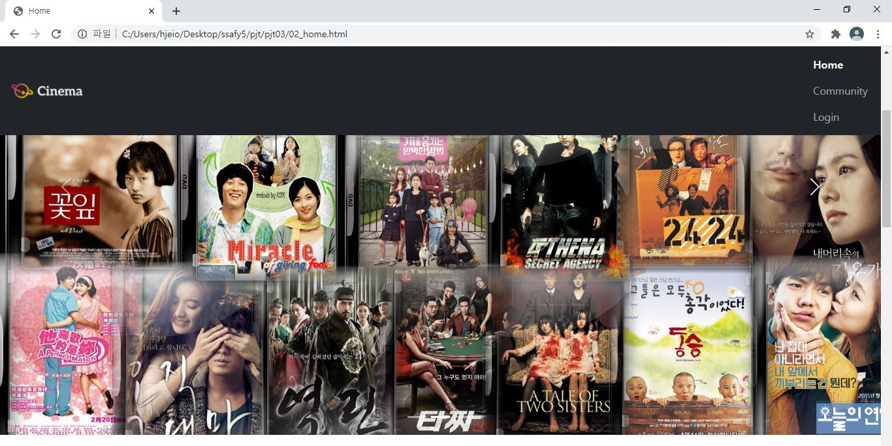
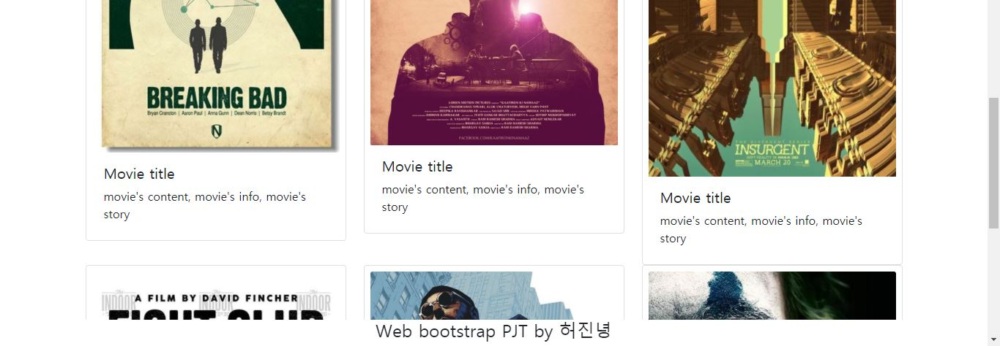
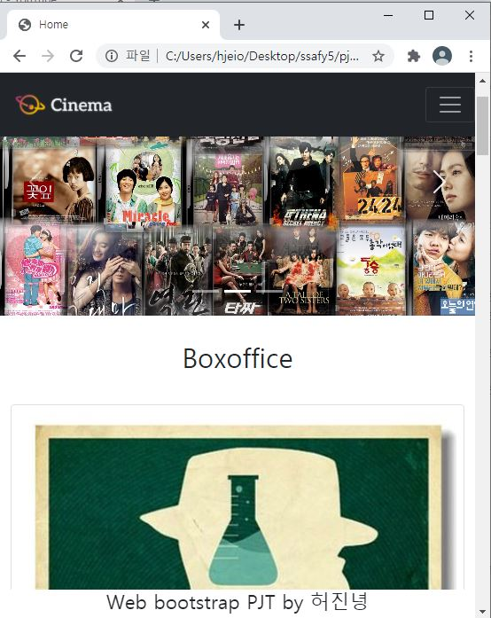
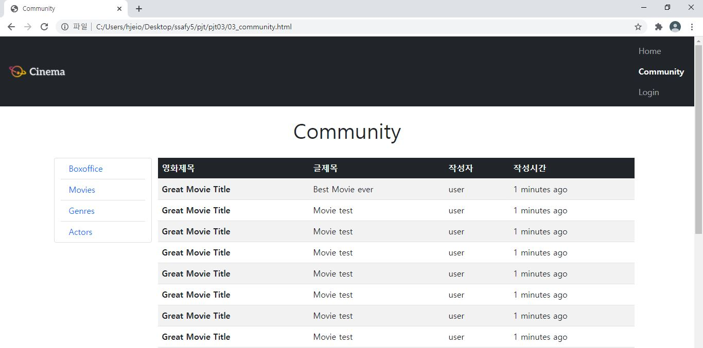
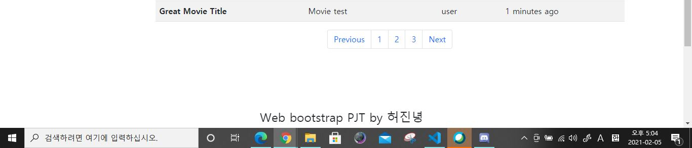
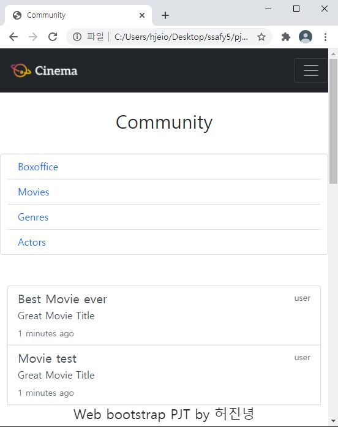
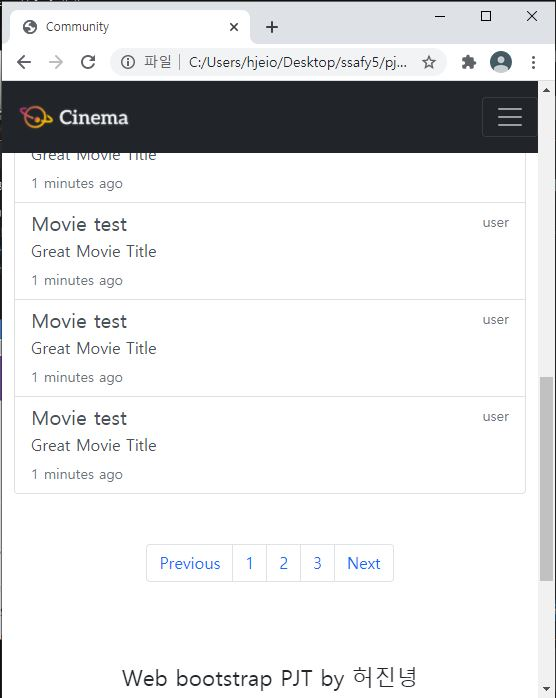

# Project 03

## 1.

### navbar





d-none, d-block를 사용하여 pixel별로 바뀌게 했다. 

sticky-top으로 상단에 고정

우측으로 정렬한 요소들이 계속 세로로 정렬되는데 결국 해결 못했다. 딴 건 다 했는데. 안타까워라.

.


### modal



```
class="modal fade" id="exampleModal"
```

```
<a class="nav-link text-secondary" href="#"  data-bs-toggle="modal" data-bs-target="#exampleModal">Login</a>
```

modal창에 로그인폼을 넣었다.

.


### footer

웹 하단에 고정되고 중앙에 텍스트가 정렬되는 것을 확인.

.


 

## 2.

### header



```
<div id="carouselExampleIndicators" class="carousel slide" data-bs-ride="carousel">
```

carousel로 3개의 헤더 이미지가 슬라이드 된다.

.


### section





영화 이미지들로 만든 card클래스의 article들을 표시.

카드들의 정렬은 

```html
<section class="container">
    <div class="row justify-content-around">
      <article class="col-sm-4 col-xs-12">
          ''''''
```

으로 부트스트랩을 사용하여 정렬했다. 

576px 미만일때는 하나의 카드가 화면전체 너비를 차지하고 그 외에는 3개의 카드가 한 줄씩 차지하는 것을 확인할 수 있었다.

.


 

## 3.









.


### list

container-row-col의 구조로 게시판 목록aside과 게시판의 공간section을 나눠준다.

992px를 기준으로 차지하는 너비가 바뀌므로

```html
<aside class="col-lg-2 col-12 card h-100">
```

로 설정하여 공간을 할당해 제대로 작동하는 것읗 확인.

.


### board-table

992px 이상일 때는 table의 형태로 게시판이 노출된다. 그 외의 상황에는 안보여야함.

```
class="col-lg-10 d-none d-lg-block"
```

으로 만든 div안에 

```html
<table class="table table-striped table-hover">
  <thead class="table-dark">
      ''''''
```

내용을 작성하여 992px이상일때만 해당 테이블이 등장하는 것을 확인.

pagination도 게시판 밑에 위치하게 했다.

.


### board-article

992px미만일 때는 table이 숨겨지고 article로 구성한 영화 내용이 노출되야 한다.

```html
<div class="d-lg-none col-12">
  <div style="height: 50px;"></div>
    <article class="list-group">
        ''''''
```

이렇게 구성한 리스트 형식으로 article을 채운다.

992px 미만일 때 table대신 article이 등장하는 것을 확인.

.

