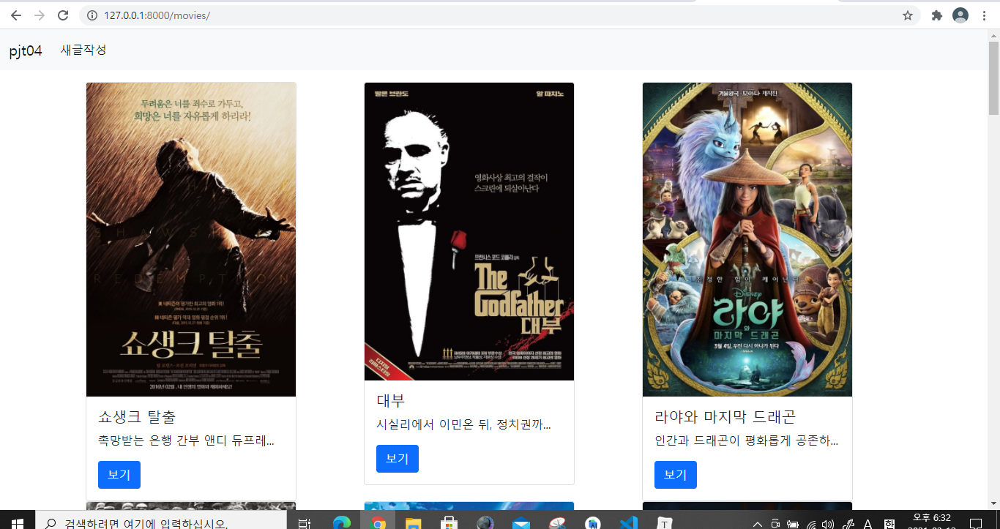
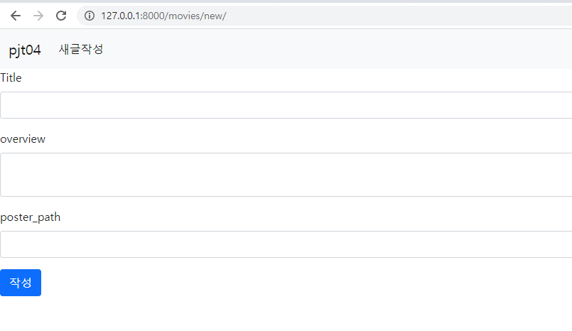
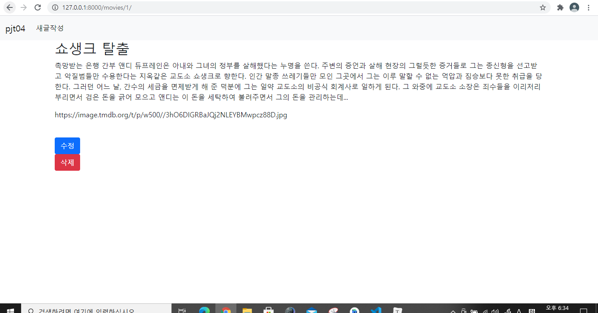
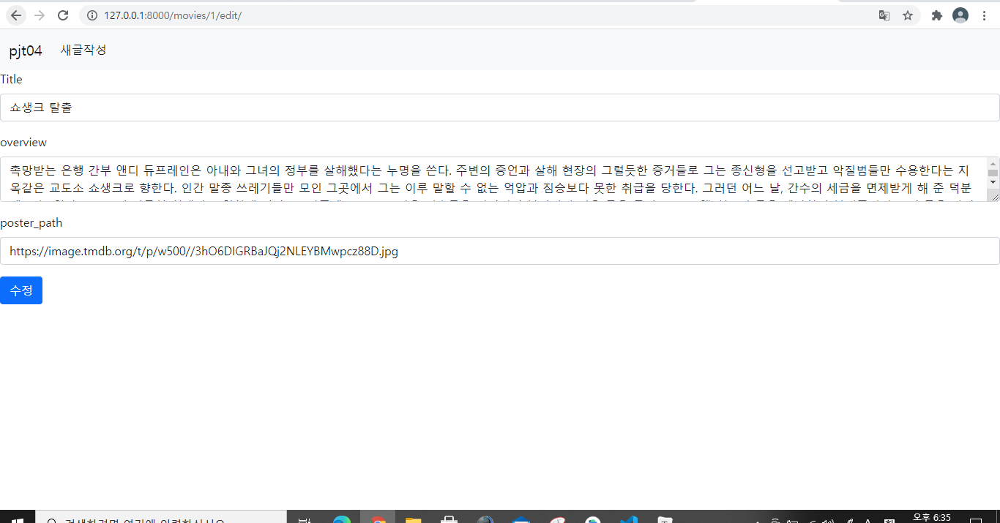
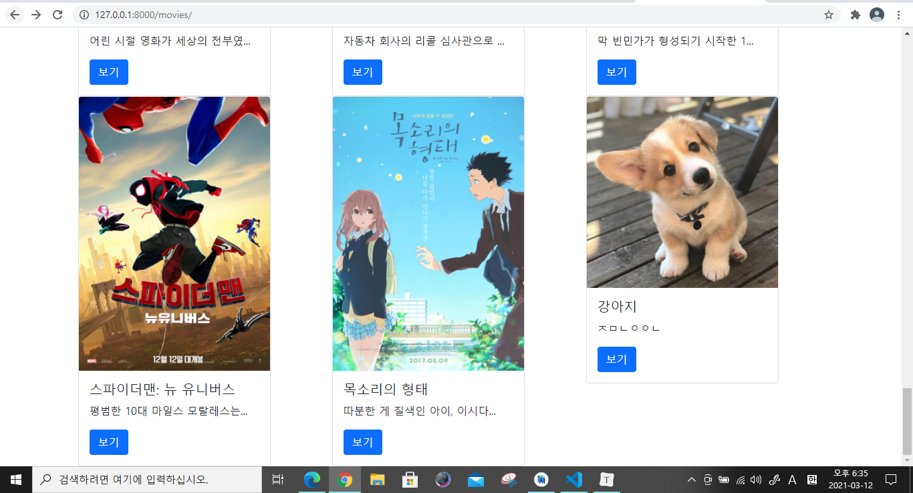
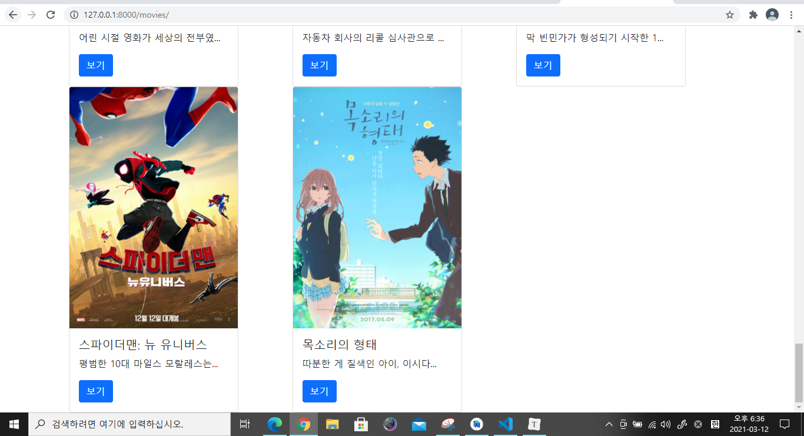

# 관통형 프로젝트 04 (0312)

### settings.py를 비롯한 사전 설정

```
python -m venv venv
source venv/Scripts/activate
pip install django
django-admin startproject pjt04 .
python manage.py startapp movies
```

```python
## settings.py에 TEMPLATES의 DIRS에 내용 추가
'DIRS': [BASE_DIR / 'pjt04' / 'templates',],

## 시간 설정
LANGUAGE_CODE = 'ko-kr'

TIME_ZONE = 'Asia/Seoul'
```


### model 구성, 적용

```python
## 명세대로 Movie에 들어갈 title, overview, poster_path 
class Movie(models.Model):
    title = models.CharField(max_length=100)
    overview = models.TextField()
    poster_path = models.CharField(max_length=500)
```

```
python manage.py makemigrations
python manage.py migrate
```


### fixtures로 json 데이터를 db에 가져오기

```
## movies/fixtures에 movies.json 위치
python manage.py loaddata movies.json
```


### base.html

부트스트랩 적용, navigation 적용

```html
<!DOCTYPE html>
<html lang="en">
<head>
    <meta charset="UTF-8">
    <meta http-equiv="X-UA-Compatible" content="IE=edge">
    <meta name="viewport" content="width={device-width}, initial-scale=1.0">
    <link href="https://cdn.jsdelivr.net/npm/bootstrap@5.0.0-beta2/dist/css/bootstrap.min.css" rel="stylesheet" integrity="sha384-BmbxuPwQa2lc/FVzBcNJ7UAyJxM6wuqIj61tLrc4wSX0szH/Ev+nYRRuWlolflfl" crossorigin="anonymous">
    <title>Document</title>
</head>
<body>
    <nav class="navbar navbar-expand-lg navbar-light bg-light">
        <div class="container-fluid">
            <a class="navbar-brand" href="">pjt04</a>
            <button class="navbar-toggler" type="button" data-bs-toggle="collapse" data-bs-target="#navbarNav" aria-controls="navbarNav" aria-expanded="false" aria-label="Toggle navigation">
            <span class="navbar-toggler-icon"></span>
            </button>
            <div class="collapse navbar-collapse" id="navbarNav">
            <ul class="navbar-nav">
                <li class="nav-item">
                <a class="nav-link active" aria-current="page" href="">새글작성</a>
                </li>
            </ul>
            </div>
        </div>
    </nav>
        
        
    </div>
    <script src="https://cdn.jsdelivr.net/npm/bootstrap@5.0.0-beta2/dist/js/bootstrap.bundle.min.js" integrity="sha384-b5kHyXgcpbZJO/tY9Ul7kGkf1S0CWuKcCD38l8YkeH8z8QjE0GmW1gYU5S9FOnJ0" crossorigin="anonymous"></script>
</body>
</html>
```


### url 구성

```python
from django.urls import path
from . import views

# 명세대로 url구성
app_name = 'movies'
urlpatterns = [
    path('', views.index, name='index'),  # R
    path('new/', views.new, name='new'),  # C
    path('create/', views.create, name='create'),
    path('<int:pk>/', views.detail, name='detail'),  # R

    path('<int:pk>/edit/', views.edit, name='edit'),  # U
    path('<int:pk>/update/', views.update, name='update'),
    path('<int:pk>/delete/', views.delete, name='delete'),  # D
]
```


### 메인페이지(index함수, index.html)

```python
# Read
def index(request):
    movies = Movie.objects.all()  # 모든 영화 정보 내놔
    context = {
        'movies': movies,
    }
    
    return render(request, 'movies/index.html', context)
```

```html



    <div class="container mt-3">
        <div class='row'>
            
                <div class="col-4">  <!--이건 부투스트랩에서 가져옴-->
                    <div class="card" style="width: 18rem;">
                        
                        <div class="card-body">
                            <h5 class="card-title">{{ movie.title }}</h5>
                            <p class="card-text"> {{ movie.overview|truncatechars:20 }} </p>
                            <a href="" class="btn btn-primary">보기</a>
                        </div>
                    </div>
                </div>
            
        </div>

    </div>


```



앱네임을 헷갈려서 에러를 오래 겪었다. 흑흑


### create, read, update, delete 함수 및 html 짜기

- CREATE

```python
## views.py
# Create
def new(request):
    return render(request, 'movies/new.html')


def create(request):
    title = request.POST.get('title')
    overview = request.POST.get('overview')
    poster_path = request.POST.get('poster_path')  # 받아온 정보들로

    movie = Movie(title=title, overview=overview, poster_path=poster_path)  # 새로운 Movie생성
    movie.save()

    return redirect('movies:index')
```

```html



<form action="" method="POST">  <!--이건 부투스트랩에서 가져옴-->
  
  <div class="mb-3">
    <label for="title" class="form-label">Title</label>
    <input type="text" class="form-control" name="title" id="title" maxlength=100>
  </div>
  <div class="mb-3">
    <label for="overview" class="form-label">overview</label>
    <textarea name="overview" id="overview" class="form-control"></textarea>
  </div>
  <div class="mb-3">
    <label for="poster_path" class="form-label">poster_path</label>
    <input type="text" class="form-control" name="poster_path" id="poster_path" maxlength=500>
  </div>
  <button type="submit" class="btn btn-primary">작성</button>
</form>


```




- READ

```python
# Read
def index(request):
    movies = Movie.objects.all()  # 모든 영화 정보 내놔
    context = {
        'movies': movies,
    }
    
    return render(request, 'movies/index.html', context)


def detail(request, pk):
    movie = Movie.objects.get(pk=pk)  # 해당 pk의 글만 불러옴
    context = {
        'movie': movie,
    }
    return render(request, 'movies/detail.html', context)
```

```html



<div class="container">
  <h2>{{ movie.title }}</h2>
  <p>{{ movie.overview }}</p>
  <p>{{ movie.poster_path }}</p>
  
  <br>
  <a href="">
  <button type="button" class="btn btn-primary">수정</button>
  </a>
  <form action="" method='POST'>
    
    <button class="btn btn-danger">삭제</button>
  </form>
</div>

```



(사진은 밑의 버튼 보이라고 일단 숨김)


- UPDATE

```python
# Update
def edit(request, pk):
    movie = Movie.objects.get(pk=pk)
    context = {
        'movie': movie,
    }
    return render(request, 'movies/edit.html', context)


def update(request, pk):
    movie = Movie.objects.get(pk=pk)  # 해당 글을 불러와서 

    title = request.POST.get('title')
    overview = request.POST.get('overview')
    poster_path = request.POST.get('poster_path')

    movie.title = title
    movie.overview = overview
    movie.poster_path = poster_path  # 새 정보로 업데이트
    movie.save()

    return redirect('movies:detail', movie.pk)
```

```html



<form action="" method="POST">
  
  <div class="mb-3">
    <label for="title" class="form-label">Title</label>
    <input type="text" class="form-control" name="title" id="title" value="{{ movie.title }}" maxlength=100>
  </div>
  <div class="mb-3">
    <label for="overview" class="form-label">overview</label>
    <textarea name="overview" id="overview" class="form-control">{{ movie.overview }}</textarea>
  </div>
  <div class="mb-3">
    <label for="poster_path" class="form-label">poster_path</label>
    <input type="text" class="form-control" name="poster_path" id="poster_path" value="{{ movie.poster_path }}" maxlength=500>
  </div>
  <button type="submit" class="btn btn-primary">수정</button>
</form>


```




- DELETE

```python

# Delete
def delete(request, pk):
    movie = Movie.objects.get(pk=pk)  # 해당 pk의 글을 

    if request.method == 'POST': # 포스트방식 입력이라면 삭제
        movie.delete()
        return redirect('movies:index')
    else:
        return redirect('movies:detail', pk)
```






삭제후