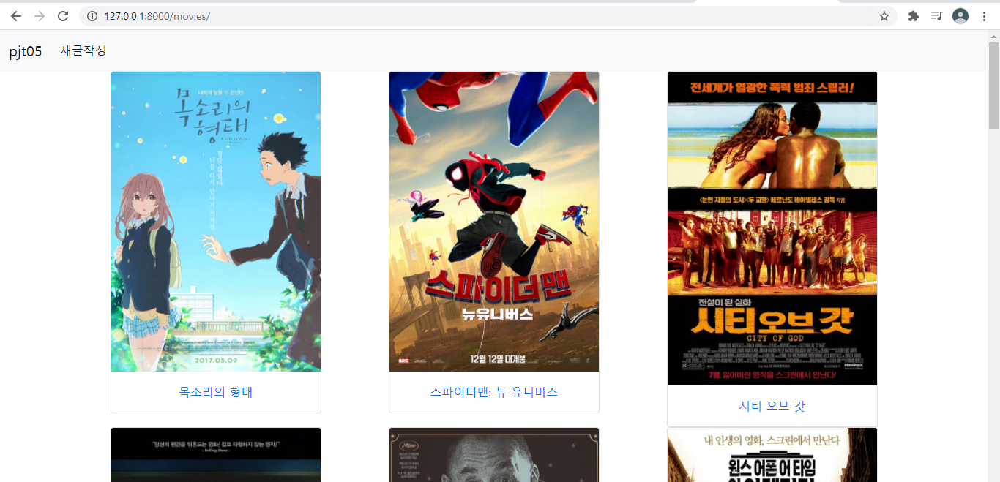
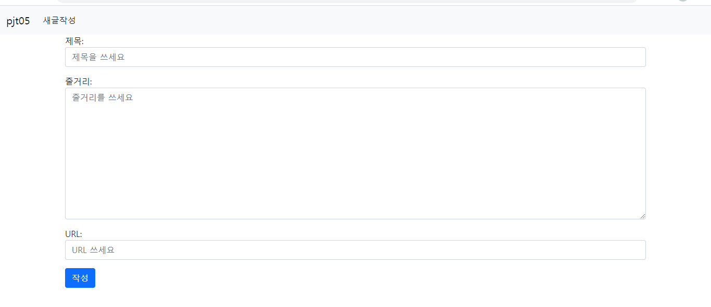
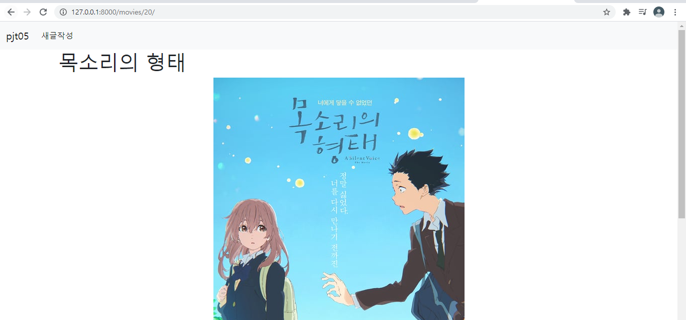
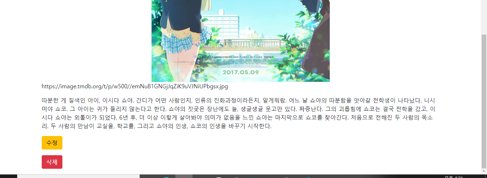
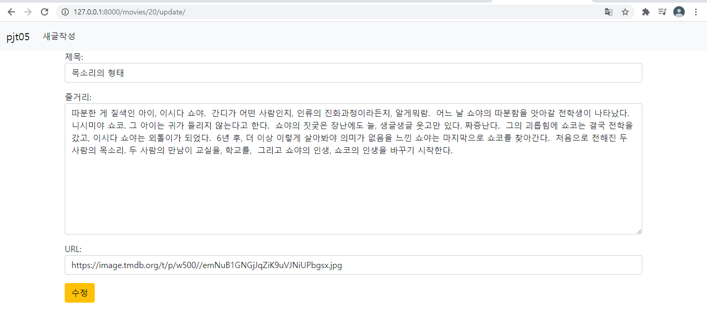

# 3월 19일자 모델폼, CRUD정리


## 가상환경 만들기, 사전 설정, setting.py

```
python -m venv venv
source venv/Scripts/activate
pip install django
django-admin startproject pjt05 .
python manage.py startapp movies
```

```python
'DIRS': [BASE_DIR / 'pjt05' / 'templates',],
    
LANGUAGE_CODE = 'ko-kr'

TIME_ZONE = 'Asia/Seoul'
```


## model 구성, migrate, loaddata

```python
class Movie(models.Model):  # 모델 구성
    title = models.CharField(max_length=100)
    overview = models.TextField()
    poster_path = models.CharField(max_length=500)  # 명세대로
```

```
python manage.py makemigrations
python manage.py migrate
python manage.py loaddata movies/movies.json  # fixtures/movies/movies.json
```

```python
## admin.py에 model 등록. 이제 admin페이지에서 Movie다루기 가능
# movies/admin.py
from django.contrib import admin
from .models import Movie

admin.site.register(Movie)
```


## urls.py, base.html

```python
# pjt05/urls.py
from django.contrib import admin
from django.urls import path, include

urlpatterns = [
    path('admin/', admin.site.urls),
    path('movies/', include('movies.urls')),
]
```

```python
# movies/urls.py
from django.urls import path
from . import views

app_name = 'movies'
urlpatterns = [
    path('', views.index, name='index'),
]
```

base.html은 후에 상속을 위해 block을 뚫고, bootstrap CDN 적용


## 메인 페이지(index.html)

base.html을 상속받음

```html



<div class="row">
    
        <div class="col-4">
            <div class="d-flex justify-content-center">
                <div class="card" style="width: 18rem;">
                    
                    <div class="card-body text-center">
                        <p class="card-text"><a class="text-decoration-none" href="">{{ movie.title }}</a></p>
                    </div>
                </div>
            </div>
        </div>
    
</div>

```

```python
# movies/views.py
from django.shortcuts import render, get_object_or_404, redirect
from .models import Movie
from django.views.decorators.http import require_safe, require_http_methods, require_POST
from .forms import MovieForm


@require_safe
def index(request):
    movies = Movie.objects.order_by('-pk')
    context = {
        'movies': movies,
    }
    return render(request, 'movies/index.html', context)
```



한 줄에 3영화씩 나오게 class를 설정.

bootstrap의 card를 적용.

제목 클릭시 세부 내용으로 갈 수 있는 링크.


## ModelForm 구성 (forms.py)

movies/forms.py 파일 생성

```python
from django import forms
from .models import Movie

class MovieForm(forms.ModelForm):
    class Meta:
        model = Movie
        fields = '__all__'
```


## Create

```python
# movies/urls.py
from django.urls import path
from . import views

app_name = 'movies'
urlpatterns = [
    path('', views.index, name='index'),
    path('create/', views.create, name='create'),
]
```

```python
# movies/views.py
@require_http_methods(['GET', 'POST'])
def create(request):
    if request.method == 'POST':
        form = MovieForm(request.POST)
        if form.is_valid:
            movie = form.save()
            return redirect('movies:index')
    else:
        form = MovieForm()
    context = {
        'form': form,
    }
    return render(request, 'movies/create.html', context)
```

데코레이터를 통해 GET, POST 두 방식일때만 동작하도록 설정


modelform을 forms.py에서 설정하여 class등 부여

```python
from django import forms
from .models import Movie

class MovieForm(forms.ModelForm):
    title = forms.CharField(
        label = '제목',
        widget = forms.TextInput(
            attrs={
                'class': 'form-control',
                'placeholder':'제목을 쓰세요',
            }
        )
    )
    overview = forms.CharField(
        label = '줄거리',
        widget = forms.Textarea(
            attrs={
                'class': 'form-control',
                'placeholder':'줄거리를 쓰세요',
            }
        )
    )
    poster_path = forms.CharField(
        label = 'URL',
        widget = forms.TextInput(
            attrs={
                'class': 'form-control',
                'placeholder':'URL 쓰세요',
            }
        )
    )
    class Meta:
        model = Movie
        fields = '__all__'
```



훨씬 예뻐짐.


## detail 페이지

```html



    <h1>{{ movie.title }}</h1>
    <div class="d-flex justify-content-center">
        
    </div>
    <p>{{ movie.poster_path }}</p>
    <p>{{ movie.overview }}</p>
    <p><a class="btn btn-warning" href="">수정</a></p>
    <p>
    <form action="" method='POST'>
        
        <button class="btn btn-danger">삭제</button>
    </form>
    </p>

```

urls.py에 `path('<int:pk>/', views.detail, name='detail'),` 추가 

```python
# movies/views.py
@require_safe
def detail(request, pk):
    movie = get_object_or_404(Movie, pk=pk)
    context = {
        'movie': movie
    }
    return render(request, 'movies/detail.html', context)
```






## Update

```html



<form method="POST">
    
    {{ form.as_p }}
    <button class="btn btn-warning">수정</button>
</form>

```

urls.py에`path('<int:pk>/update/', views.update, name='update'),` 추가 

```python
# movies/views.py
@require_http_methods(['GET', 'POST'])
def update(request, pk):
    movie = get_object_or_404(Movie, pk=pk)
    if request.method == 'POST':
        form = MovieForm(request.POST, instance=movie)
        if form.is_valid():
            form.save()
            return redirect('movies:detail', movie.pk)
    else:
        form = MovieForm(instance=movie)
    context = {
        'form': form,
    }
    return render(request, 'movies/update.html', context)
```



create와 거의 비슷함


## Delete

urls.py에`path('<int:pk>/delete', views.delete, name='delete'),` 추가 

```python
@require_POST
def delete(request, pk):
    movie = get_object_or_404(Movie, pk=pk)
    movie.delete()
    return redirect('movies:index')
```

데코레이터를 통해 POST방식일때만 동작하게 설정함

