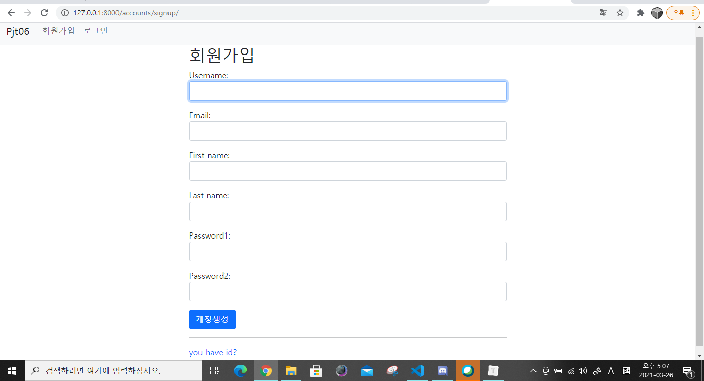
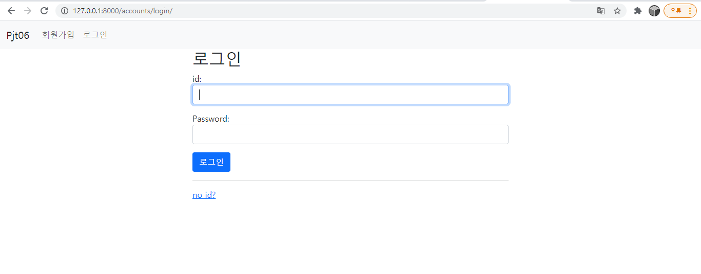
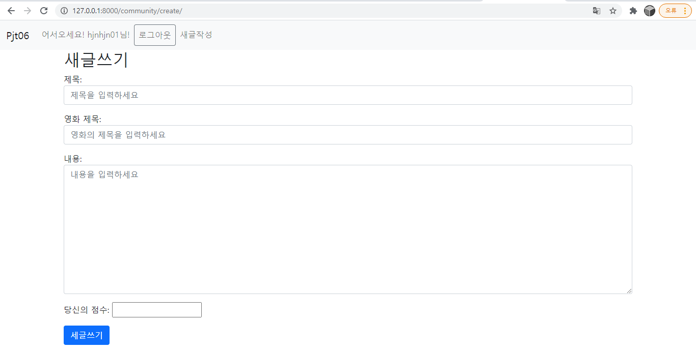
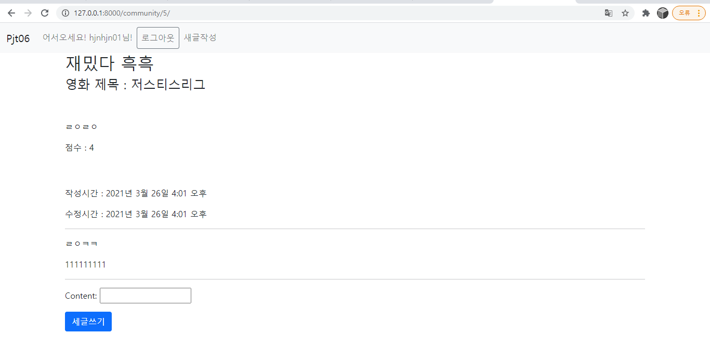

# Pjt06

## 1. model구성

```python
# accounts/models.py
from django.db import models
from django.contrib.auth.models import AbstractUser

class User(AbstractUser):
    pass
```

커스텀 유저를 사용하려면 settings.py에 `AUTH_USER_MODEL = 'accounts.User'`를 꼭 써줘야한다. (첫 migrate전에)


```python
# community/models.py
from django.db import models
from pjt06 import settings

# Create your models here.
class Review(models.Model):
    title = models.CharField(max_length=100)
    movie_title = models.CharField(max_length=50)
    rank = models.IntegerField()
    content = models.TextField()
    created_at = models.DateTimeField(auto_now_add=True)
    updated_at = models.DateTimeField(auto_now=True)
    user_id = models.ForeignKey(settings.AUTH_USER_MODEL, on_delete=models.CASCADE)


class Comment(models.Model):
    content = models.CharField(max_length=100)
    review_id = models.ForeignKey(Review, on_delete=models.CASCADE)
    user_id = models.ForeignKey(settings.AUTH_USER_MODEL, on_delete=models.CASCADE)
    created_at = models.DateTimeField(auto_now_add=True)
    updated_at = models.DateTimeField(auto_now=True)
```

Foreignkey를 사용함.

admin 페이지에서 볼 수 있게 `admin.py`에 `admin.site.register(Review)`, `admin.site.register(Comment)` 를 넣음.


## 2. form 구성

```python
# community/forms.py
from django import forms
from .models import Review, Comment


class ReviewForm(forms.ModelForm):
    title = forms.CharField(
        label='제목',
        widget=forms.TextInput(
            attrs={
                'class': 'form-control',
                'placeholder': '제목을 입력하세요',
            }
        )
    )
    movie_title = forms.CharField(
        label='영화 제목',
        widget=forms.TextInput(
            attrs={
                'class': 'form-control',
                'placeholder': '영화의 제목을 입력하세요',
            }
        )
    )
    content = forms.CharField(
        label='내용',
        widget=forms.Textarea(
            attrs={
                'class': 'form-control',
                'placeholder': '내용을 입력하세요',
            }
        )
    )
    rank = forms.IntegerField(
        label='당신의 점수',
    )
    class Meta:
        model = Review
        fields = ('title', 'movie_title', 'content', 'rank')
        

class CommentForm(forms.ModelForm):
    class Meta:
        model = Comment
        fields = ('content',)
```

좀 지저분해 보여서 widget으로 부트스트랩 속성을 줌

```python
from django.contrib.auth.forms import UserCreationForm, AuthenticationForm, UsernameField
from django.contrib.auth import get_user_model
from django import forms


class CustomUserCreationForm(UserCreationForm):
    username = UsernameField(
        widget=forms.TextInput(
            attrs={
                'class': 'form-control',
                'autofocus': True,
                }
            )
    )
    password1 = forms.CharField(
        widget=forms.PasswordInput(
            attrs={
                'class': 'form-control',
                'autocomplete': 'new-password',
                }
            )
    )
    password2 = forms.CharField(
        widget=forms.PasswordInput(
            attrs={
                'class': 'form-control',
                'autocomplete': 'new-password',
                }
            )
    )
    email = forms.CharField(
        widget = forms.TextInput(
            attrs={
                'class': 'form-control',
            }
        )
    )
    first_name = forms.CharField(
        widget = forms.TextInput(
            attrs={
                'class': 'form-control',
            }
        )
    )
    last_name = forms.CharField(
        widget = forms.TextInput(
            attrs={
                'class': 'form-control',
            }
        )
    )
    class Meta:
        model = get_user_model()
        fields = ('username', 'email', 'first_name', 'last_name')

class CustomAuthenticationForm(AuthenticationForm):
    username = UsernameField(
        label = 'id',
        widget=forms.TextInput(
            attrs={
                'class': 'form-control',
                'autofocus': True,
                }
            )
    )
    password = forms.CharField(
        widget=forms.PasswordInput(
            attrs={
                'class': 'form-control',
                'autocomplete': 'new-password',
                }
            )
    )
    class Meta:
        model = get_user_model()
        fields = '__all__'

```

커스텀 유저를 사용할 때에는 UserCreationForm을 쓰면 에러가 난다.

원래 내장된 auth.user로 연결이 되기 때문. 

우리는 위에서 커스텀 유저 accounts.user로 설정을 해놨기 떄문에 form도 커스텀 폼을 사용해야 한다.


## 3. url구성

```python
# pjt06/urls.py
from django.contrib import admin
from django.urls import path, include

urlpatterns = [
    path('admin/', admin.site.urls),
    path('accounts/', include('accounts.urls')),
    path('community/', include('community.urls')),
]
```

```python
# community/urls.py
from django.urls import path
from . import views

app_name = 'community'
urlpatterns = [
    path('', views.index, name='index'),
    path('create/', views.create, name='create'),
    path('<int:review_pk>/', views.detail, name='detail'),
    path('<int:review_pk>/comments/', views.comments_create, name='comments_create'),
]

```

```python
# accounts/urls.py
from django.urls import path
from . import views

app_name = 'accounts'
urlpatterns = [
    path('signup/', views.signup, name='signup'),
    path('login/', views.login, name='login'),
    path('logout/', views.logout, name='logout'),
]

```

명세에 나온 것 그대로 구성해주면 된다.


## 4. base.html

먼저 settings.py에 `'DIRS': [BASE_DIR / 'pjt06' / 'templates'],`로 경로를 설정해준다.

```html
<!DOCTYPE html>
<html lang="en">
<head>
  <meta charset="UTF-8">
  <meta http-equiv="X-UA-Compatible" content="IE=edge">
  <meta name="viewport" content="width=device-width, initial-scale=1.0">
  <title>Document</title>
  <link href="https://cdn.jsdelivr.net/npm/bootstrap@5.0.0-beta2/dist/css/bootstrap.min.css" rel="stylesheet" integrity="sha384-BmbxuPwQa2lc/FVzBcNJ7UAyJxM6wuqIj61tLrc4wSX0szH/Ev+nYRRuWlolflfl" crossorigin="anonymous">
</head>
<body>
  <nav class="navbar navbar-expand-lg navbar-light bg-light">
    <div class="container-fluid">
      <a class="navbar-brand" href="">Pjt06</a>
      <button class="navbar-toggler" type="button" data-bs-toggle="collapse" data-bs-target="#navbarNav" aria-controls="navbarNav" aria-expanded="false" aria-label="Toggle navigation">
        <span class="navbar-toggler-icon"></span>
      </button>
      <div class="collapse navbar-collapse" id="navbarNav">
        <ul class="navbar-nav">
          
            <li class="nav-item">
              <a class="nav-link" href="#">어서오세요! {{ request.user }}님!</a>
            </li>
            <li class="nav-item">
              <form action="" method="POST">
                
                <button class="btn btn-outline-secondary nav-link">로그아웃</button>
              </form>
            </li>
            <li class="nav-item">
              <a class="nav-link" href="">새글작성</a>
            </li>
          
            <li class="nav-item">
              <a class="nav-link" href="">회원가입</a>
            </li>
            <li class="nav-item">
              <a class="nav-link" href="">로그인</a>
            </li>
          
        </ul>
      </div>
    </div>
  </nav>

  <div class="container">
    
    
  </div>

  <script src="https://cdn.jsdelivr.net/npm/bootstrap@5.0.0-beta2/dist/js/bootstrap.bundle.min.js" integrity="sha384-b5kHyXgcpbZJO/tY9Ul7kGkf1S0CWuKcCD38l8YkeH8z8QjE0GmW1gYU5S9FOnJ0" crossorigin="anonymous"></script>  
</body>
</html>
```

bootstrap cdn 설정

계정관련, 새글작성링크를 navbar에 넣음.

content블럭 넣음.


## 5. 로그인, 회원가입

```python
# accounts/views.py
from django.shortcuts import render, redirect
from django.contrib.auth.forms import AuthenticationForm, UserCreationForm
from django.contrib.auth import login as auth_login
from django.contrib.auth import logout as auth_logout
from django.views.decorators.http import require_http_methods
from .forms import CustomUserCreationForm, CustomAuthenticationForm

# Create your views here.
@require_http_methods(['GET', 'POST'])
def signup(request):
    if request.method == 'POST':
        form = CustomUserCreationForm(request.POST)
        if form.is_valid():
            user = form.save()
            auth_login(request, user)
            return redirect('community:index')
    else:
        form = CustomUserCreationForm()
    context = {
        'form': form,
    }
    return render(request, 'accounts/signup.html', context)


@require_http_methods(['GET', 'POST'])
def login(request):
    if request.user.is_authenticated:
        return redirect('community:index')

    if request.method == 'POST':
        form = CustomAuthenticationForm(request, request.POST)
        if form.is_valid():
            auth_login(request, form.get_user())
            return redirect('community:index')
    else:
        form = CustomAuthenticationForm()
    context = {
        'form': form,
    }
    return render(request, 'accounts/login.html', context)


def logout(request):
    auth_logout(request)
    return redirect('community:index')
```

CustomUserCreationForm을 쓰지 않아서 에러가 발생했었다.






form에서 attr로 속성을 줘서 좀 더 이뻐짐 


## 6. 리뷰쓰기, 보기

```python
# community/views.py
from django.shortcuts import render, redirect, get_object_or_404
from .models import Review, Comment
from .forms import ReviewForm, CommentForm
from django.views.decorators.http import require_http_methods, require_POST, require_safe

# Create your views here.
@require_safe
def index(request):
    reviews = Review.objects.order_by('-pk')
    context = {
        'reviews':reviews,
    }
    return render(request, 'community/index.html', context)


@require_http_methods(['GET', 'POST'])
def create(request):
    if request.method == 'POST':
        form = ReviewForm(request.POST)
        if form.is_valid():
            reviews = form.save(commit=False)
            reviews.user_id = request.user
            reviews.save()
            return redirect('community:index')
    else:
        form = ReviewForm()

    context = {
        'form':form,
    }
    return render(request, 'community/create.html', context)


@require_safe
def detail(request, review_pk):
    review = get_object_or_404(Review, pk=review_pk)
    comment_form = CommentForm()
    context = {
        'comment_form': comment_form,
        'review': review,
    }
    return render(request, 'community/detail.html', context)

```

리뷰를 create하는 과정에서 user_id를 받아오는 과정에서 에러가 있었다.

`reviews.user_id = request.user`의 부분에서 받아오고, `save()`까지 해줘야 작동한다.

forms에 부트스트랩 속성 넣어놔서 깔끔하게 보인다.




## 7. 댓글

```python

@require_POST
def comments_create(request, review_pk):
    if request.user.is_authenticated:
        review = get_object_or_404(Review, pk=review_pk)
        comment_form = CommentForm(request.POST)
        if comment_form.is_valid():
            comment = comment_form.save(commit=False)
            comment.review_id = review
            comment.user_id = request.user
            comment.save()
            return redirect('community:detail', review_pk)

        context = {
            'comment_form': comment_form,
            'review': review,
        }
        return render(request, 'community/detail.html', context)

    return redirect('accounts:login')
```

POST일때만 동작하며, user가 로그인 하지 않았을 떄는 로그인 페이지로 리데이렉트 시킨다. 디테일 페이지에서도 로그인하지 않으면 댓글작성 부분이 안보이게 html구성했다.



