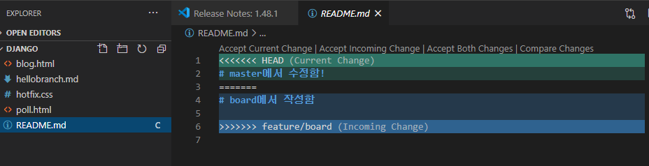

# branch

## 기본명령어

* 브랜치목록

```bash
$ git branch
```

* 브랜치생성

```bash
$ git branch {브랜치이름}
```

* 브랜치 이동

```bash
$ git checkout {브랜치이름}
```

```bash
$ git checkout -b {브랜치이름}
#브랜치 생성 및 이동 한번에
```

* 브랜치 병합

```bash
(master) $ git merge {브랜치이름}
```

{브랜치이름}을 (master)로 병합

* 브랜치 삭제

```bash
$ git branch -d {브랜치이름}
```


### 상황 1. fast-foward

> fast-foward는 feature 브랜치 생성된 이후 master 브랜치에 변경 사항이 없는 상황

1. feature/blog branch 생성 및 이동

   ```bash
   (master) $ git checkout -b feature/blog
   Switched to a new branch 'feature/blog'
   ```

2. 작업 완료 후 commit

   ```bash
   $ touch blog.html
   $ git add .
   $ git commit -m 'Complete blog app'
   [feature/blog 56835a2] Complete blog app
    1 file changed, 0 insertions(+), 0 deletions(-)
    create mode 100644 blog.html
   $ git log --oneline
   56835a2 (HEAD -> feature/blog) Complete blog app
   867e2bf (master) Hello branch
   8add9bc init commit
   ```


3. master 이동

   ```bash
   $ git checkout master
   Switched to branch 'master'
   $ git log --oneline
   867e2bf (HEAD -> master) Hello branch
   8add9bc init commit
   ```


4. master에 병합

   ```bash
   $ git merge feature/blog
   Updating 867e2bf..56835a2
   Fast-forward
    blog.html | 0
    1 file changed, 0 insertions(+), 0 deletions(-)
    create mode 100644 blog.html
   ```


5. 결과 -> fast-foward (단순히 HEAD를 이동)

   ```bash
   $ git log --oneline
   56835a2 (HEAD -> master, feature/blog) Complete blog app
   867e2bf Hello branch
   8add9bc init commit
   ```

6. branch 삭제

   ```bash
   $ git branch -d feature/blog
   Deleted branch feature/blog (was 56835a2).
   ```
   
   

---

### 상황 2. merge commit

> 서로 다른 이력(commit)을 병합(merge)하는 과정에서 다른 파일이 수정되어 있는 상황
>
> git이 auto merging을 진행하고, commit이 발생된다.

1. feature/poll branch 생성 및 이동

   ```bash
   $ git checkout -b feature/poll
   Switched to a new branch 'feature/poll'
   ```

2. 작업 완료 후 commit

   ```bash
   $ touch hotfix.css
   $ git add .
   $ git commit -m 'poll commit'
   ```

   

3. master 이동

   ```bash
   $ git checkout master
   Switched to branch 'master'
   ```

4. *master에 추가 commit 이 발생시키기!!*

   * **다른 파일을 수정 혹은 생성하세요!**

   ```bash
   $ touch hotfix.css
   $ git add .
   $ git commit -m 'hotfix'
   [master dd565eb] hotfix
    1 file changed, 0 insertions(+), 0 deletions(-)
    create mode 100644 hotfix.css
   $ git log --oneline
   dd565eb (HEAD -> master) hotfix
   56835a2 Complete blog app
   867e2bf Hello branch
   8add9bc init commit
   ```

5. master에 병합

   ```bash
   (master) $ git merge feature/poll
   ```

6. 결과 -> 자동으로 *merge commit 발생*

   * vim 편집기 화면이 나타납니다.
   
   * 자동으로 작성된 커밋 메시지를 확인하고, `esc`를 누른 후 `:wq`를 입력하여 저장 및 종료를 합니다.
      * `w` : write
      * `q` : quit
      
   * 커밋이  확인 해봅시다.
   
7. 그래프 확인하기

```bash
$ git log --oneline --graph
*   7949dbb (HEAD -> master) Merge branch 'feature/poll' into master
|\
| * 946e86d (feature/poll) poll commit
* | dd565eb hotfix
|/
* 56835a2 Complete blog app
* 867e2bf Hello branch
* 8add9bc init commit
```

8. branch 삭제

```bash
$ git branch -d feature/poll
Deleted branch feature/poll (was 946e86d).
```


---

### 상황 3. merge commit 충돌

> 서로 다른 이력(commit)을 병합(merge)하는 과정에서 동일 파일이 수정되어 있는 상황
>
> git이 auto merging을 하지 못하고, 해당 파일의 위치에 라벨링을 해준다.
>
> 원하는 형태의 코드로 직접 수정을 하고 merge commit을 발생 시켜야 한다.

1. feature/board branch 생성 및 이동

   ```bash
   $ git checkout -b feature/board
   Switched to a new branch 'feature/board'
   ```

2. 작업 완료 후 commit

   


3. master 이동

   ```bash
   $ git checkout master
   Switched to branch 'master'
   ```
   
   


4. *master에 추가 commit 이 발생시키기!!*

   * **동일 파일을 수정 혹은 생성하세요!**
   
```bash
   $ git log --oneline
   dd60758 (HEAD -> master) README Update on master branch
   7949dbb Merge branch 'feature/poll' into master
   dd565eb hotfix
   946e86d poll commit
   56835a2 Complete blog app
   867e2bf Hello branch
   8add9bc init commit
   ```
   
   
   
5. master에 병합

   ```bash
   $ git merge feature/board
   Auto-merging README.md
   # README에서 충돌
   CONFLICT (content): Merge conflict in README.md
   # 자동병합 실패 
   # 충돌 고치고 다시 커밋해라
   Automatic merge failed; fix conflicts and then commit the result.
   
   (master|MERGING) $
   
   $ git status
   On branch master
   You have unmerged paths.
   # 충돌 고치고 커밋
     (fix conflicts and run "git commit")
     (use "git merge --abort" to abort the merge)
   # 병합되지않은파일들
   Unmerged paths:
   # 해결하고 add해라
     (use "git add <file>..." to mark resolution)
           both modified:   README.md
   
   no changes added to commit (use "git add" and/or "git commit -a")
   ```


6. 결과 -> *merge conflict발생*

   


7. 충돌 확인 및 해결

   ```md
   <<<<<<< HEAD
   # master에서 수정함!
   =======
   # board에서 작성함
   
   >>>>>>> feature/board
   
   ```
   
   
   
   ```md
   <<<<<<< HEAD
   # master에서 수정함!
   ```
   
   ```bash
   $ git add .
   $ git commit
   [master 2aaf2ec] Merge branch 'feature/board' into master
   $ git status
   On branch master
   nothing to commit, working tree clean
   ```
   
   


8. merge commit 진행

    ```bash
    $ git commit
    ```

   * vim 편집기 화면이 나타납니다.
   
   * 자동으로 작성된 커밋 메시지를 확인하고, `esc`를 누른 후 `:wq`를 입력하여 저장 및 종료를 합니다.
      * `w` : write
      * `q` : quit
      
   * 커밋이  확인 해봅시다.
   
9. 그래프 확인하기

    ```bash
   $ git log --oneline --graph
   *   2aaf2ec (HEAD -> master) Merge branch 'feature/board' into master
   |\
   | * 431b182 (feature/board) board에서 수정함
   * | dd60758 README Update on master branch
   |/
   *   7949dbb Merge branch 'feature/poll' into master
   |\
   | * 946e86d poll commit
   * | dd565eb hotfix
   |/
   * 56835a2 Complete blog app
   * 867e2bf Hello branch
   * 8add9bc init commit
    ```


10. branch 삭제

    ```bash
    $ git branch -d feature/board
    Deleted branch feature/board (was 431b182).
    ```
    
    완료

